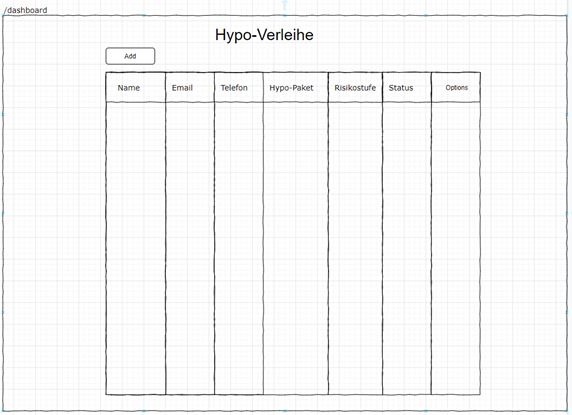
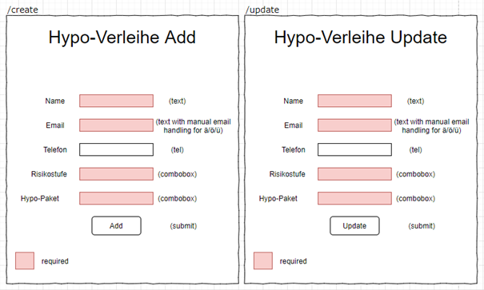
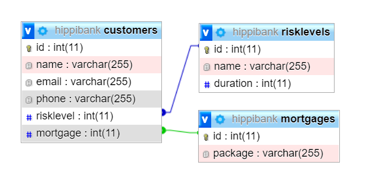

# Hypothekarbank «HippiBank»

## Team Komax
- *Alessio Vangelisti* [xAlessio](https://github.com/xAlessio)
- *Simon Schaufelberger* [Schufeli](https://github.com/Schufeli)


## Aufgabenstellung
Die Hypothekarbank «HippiBank» ist an eure Webagentur herangetreten und möchte ihre internen Abläufe für den Verleih von Hypotheken vereinfachen. Dazu soll ein Hypotheken-Webtool entwickelt werden, mit dem der Verleih von Hypotheken verwaltet werden kann. Das Tool wird nur von internen Mitarbeitern verwendet. Es muss kein Login- oder Registrierungssystem vorhanden sein da das Tool vorerst nicht direkt vom Kunden verwendet wird.

In den Grundzügen soll das Tool folgende Aufgaben übernehmen:

1. Neue Hypotheken-Verleihe sollen erfasst werden können.
2. Bestehende Hypotheken-Verleihe sollen übersichtlichen angezeigt werden können.
3. Bestehende Hypotheken-Verleihen sollen mutiert werden können.

## Sitemap
| Titel | Route (URL) | Description |
| :--- | :--- | :--- |
| Dashboard | /dashboard | Ist die "Hauptseite", welche die Übersicht aller Hypotheken und Funktionen anzeigt. | 
| Create | /create | Seite, welche dazu dient, neue Einträge in die Datenbank / Liste einzutragen |
| Update| /update | Seite, welche dazu dient, bestehende Einträge anzupassen. |
| Confirm | /confirm | Seite, welche aufgerufen wird, sobald ein Datensatz entfernt werden soll. Somit können wir Versehentliches löschen, vorzubeugen. |

## Formulare (Wireframes)
Das Dashboard ist die Mainpage der Applikation. Hier werden alle Verleihe, welche erfasst wurden, sortiert aus der Datenbank ausgelesen und angezeigt. Über das Dashboard hat man die Möglichkeit neue Verleihe zu erfassen (/create), vorhandene Verleihe zu bearbeiten (/update) und vorhanden Verleihe auch zu löschen (/confirm). Beides wird über die Requestmethode POST abgeschickt




## Validierung
| Formular | Formularfeld | Validierung |
| :--- | :--- | :--- |
| Add/Update Verleihe | Name | Trim() && not null | 
| Add/Update Verleihe | Email | Trim() && not null && spezielle Überprüfung damit Umlaute verwendet werden können | 
| Add/Update Verleihe | Telefon | Trim() && spezielle regex Überprüfung | 
| Add/Update Verleihe | Risikostufe | Not null | 
| Add Verleihe | Hypo-Paket | Not null | 
| Update Verleihe | Rückzahlungs-Status | Nicht notwendig, da es nur true oder false sein kann. |

## Testfälle
### 1. Liste der Hypothekeinträge
```
GEGEBEN SEI   Ich befinde mich auf der Dashboard route
WENN          die Datenbank nicht leer ist,
DANN          sehe ich alle Hypothek Einträge in der Liste
```
### 2. Status der Hypothek
```
GEGEBEN SEI   Ich befinde mich auf der Dashboard route
WENN          die Datenbank nicht leer ist,
DANN          sehe ich hinter jedem Eintrag das dazugehörige Icon
```
### 3. Löschen einer Hypothek
```
GEGEBEN SEI   Ich befinde mich auf der Dashboard route
WENN          die Datenbank nicht leer ist,
DANN          drücke ich auf den Delete Button und werde auf die Confirmation Route weitergeleitet
```
### 4. Bestätigung des Entfernens
```
GEGEBEN SEI   Ich befinde mich auf der Confirmation route
WENN          die Hypothek angezeigt wird,
DANN          kann ich mit dem Entfernen Knopf den Eintrag löschen.
```
### 5. Hypothek bearbeiten
```
GEGEBEN SEI   Ich befinde mich auf der Dashboard route
WENN          die Datenbank nicht leer ist,
DANN          drücke ich auf den Knopf, um einen Eintrag zu bearbeiten, somit öffnet sich das Formular für die Bearbeitung.
```
### 6. Anpassen einer Hypothek
```
GEGEBEN SEI   Ich befinde mich auf der Update route
WENN          die bearbeitbaren Einträge angezeigt werden
DANN          kann ich diese gegebenenfalls anpassen und den Vorgang abschliessen.
```

### 7. Hinzufügen einer Hypothek
```
GEGEBEN SEI   Ich befinde mich auf der Dashboard route
WENN          der Erstellenbutton gedrückt wird,
DANN          öffnet sich ein Formular, in welchem eine neue Hypothek erstellt werden kann.
```
### 8. Hinzufügen einer Hypotgek
```
GEGEBEN SEI   Ich befinde mich auf der Create route
WENN          alle Felder valide sind,
DANN          kann ich den Erfassungsprozess abschliessen.
```
### 9. Falsche Route wurde ausgewählt
```
GEGEBEN SEI   Ich verbinde auf eine falsche Route
WENN          die Route nicht im Router enthalten ist,
DANN          werde ich ohne Fehlermeldung auf die Dashboardseite zurückgesendet.
```
### 10. Status der Hypothek
```
GEGEBEN SEI   Ich befinde mich auf der Dashboard route
WENN          die Datenbank leer ist,
DANN          sehe ich einen Text, mit der Information einen neuen Eintrag zu erstellen.
```
## Datenbank

## Roadmap
### Tag 1
- Konfigurieren des Frameworks und erstellen der verschiedenen Komponenten
- Datenbank verbindung erstellen
- Modells erstellen mit den benötigten funktionen.
- Erstellen der Formulare.
- Testen der Validierung.
- Testen der Formulare.

### Tag 2
- Testen der Applikation
- Code clean-up und refactoring
- Alles bereit machen für die abgabe
